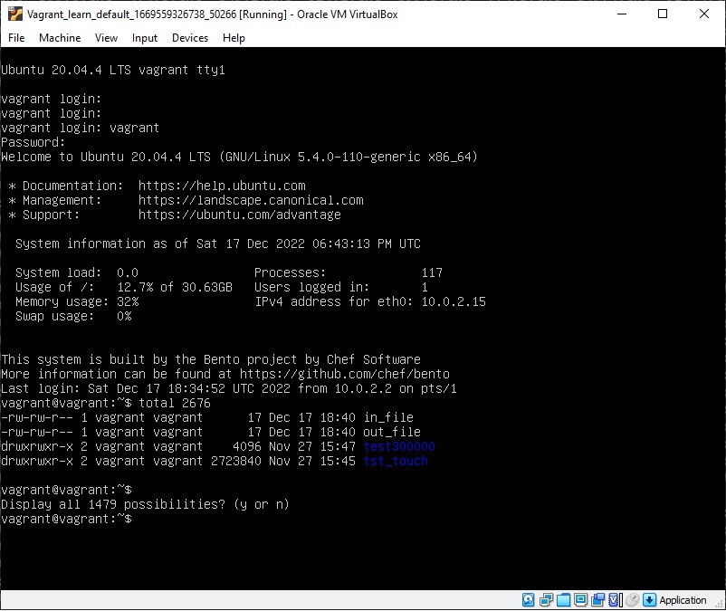

# Домашнее задание к занятию "3.2. Работа в терминале. Лекция 2"

## Какого типа команда cd? Попробуйте объяснить, почему она именно такого типа: опишите ход своих мыслей, если считаете, что она могла бы быть другого типа

Всего есть 4 типа комманд:

- Built-in Shell Commands (встроенные в оболочку команды)
- Shell Functions (функции)
- Command Alias (алиасы команд)
- excutable Programs (исполняемые программы)

      vagrant@vagrant:~$ type cd
      cd is a shell builtin

Согласно выводу выше cd получается встроенная в облочку команда. Она именно такого типа в виду того, что она меняет директорию в запущенном сеансе командной оболочки, что выглядит логично. Если бы она была внешней, то после смены директории пришлось бы запускать новый shell, в этой директории, т.к. для текущего запущенного shell это не возымела эффекта.

## Какая альтернатива без pipe команде grep <some_string> <some_file> | wc -l?

       vagrant@vagrant:~$ grep -c .
       aaaa
       sss
       2
       
       vagrant@vagrant:~$ wc -l
       aaaa
       sss
       2

## Какой процесс с PID 1 является родителем для всех процессов в вашей виртуальной машине Ubuntu 20.04?

       vagrant@vagrant:~$ pstree -p
       systemd(1)─┬─ModemManager(699)─┬─{ModemManager}(714)
                  │                   └─{ModemManager}(722)
                  ├─VBoxService(860)─┬─{VBoxService}(861)

## Как будет выглядеть команда, которая перенаправит вывод stderr ls на другую сессию терминала?

        vagrant@vagrant:~$ ls -l 123 2>/dev/pts/1

## Получится ли одновременно передать команде файл на stdin и вывести ее stdout в другой файл? Приведите работающий пример.

         vagrant@vagrant:~$ touch in_file
         vagrant@vagrant:~$ vim in_file
         vagrant@vagrant:~$ cat <in_file >out_file
         vagrant@vagrant:~$ cat out_file
         1111
         22
         
         3334
         44

## Получится ли, находясь в графическом режиме, вывести данные из PTY в какой-либо из эмуляторов TTY? Сможете ли вы наблюдать выводимые данные?

Не получится нужно переключаться в текстовый режим работы tty, тогда выполнив команду из сеанса ssh (pty1) можно увидеть вывод перенаправив его на tty1:

        vagrant@vagrant:~$ ls -l >/dev/tty1

## Выполните команду bash 5>&1. К чему она приведет? Что будет, если вы выполните echo netology > /proc/$$/fd/5? Почему так происходит?

К открытию файлового дескриптора, который отправляет данные в дескриптор 1 (stdout). При выполнении команды, получаем:

          vagrant@vagrant:~$ echo netology > /proc/$$/fd/5
          netology

Можно так же просто:

          vagrant@vagrant:~$ echo 123 >&5
          123

## Получится ли в качестве входного потока для pipe использовать только stderr команды, не потеряв при этом отображение stdout на pty?

          vagrant@vagrant:~$ ls -l 123 4>&2 2>&1 1>&4 | grep file
          ls: cannot access '123': No such file or directory

- 4>&2 новый дескриптор в stderr

- 2>&1 stderr в stdout

- 1>&4 stdout в новый дескриптор

## Что выведет команда cat /proc/$$/environ? Как еще можно получить аналогичный по содержанию вывод?

          vagrant@vagrant:~$ cat /proc/$$/environ
          SHELL=/bin/bashPWD=/home/vagrantLOGNAME=vagrantXDG_SESSION_TYPE=ttyMOTD_SHOWN=pamHOME=/home/vagrantLANG=en_US.UTF-8LS_COLORS=rs=0:di=01;34:ln=01;
          ...

Выведет текущие переменные окружения командной оболочки. Можно еще их получить так:

          vagrant@vagrant:~$ env
          SHELL=/bin/bash
          PWD=/home/vagrant
          LOGNAME=vagrant
          ...

## Используя man, опишите что доступно по адресам /proc/<PID>/cmdline, /proc/<PID>/exe.

147 строка, /proc/<PID>/cmdline файл, только для чтения, в котором хранится полная команда с которой был запущен процесс, аргументы.

198 строка, /proc/<PID>/exe файл, который является символической ссылкой на исполняемую команду.

## Узнайте, какую наиболее старшую версию набора инструкций SSE поддерживает ваш процессор с помощью /proc/cpuinfo.

          vagrant@vagrant:~$ cat /proc/cpuinfo | grep sse

SSE4_2

## При открытии нового окна терминала и vagrant ssh создается новая сессия и выделяется pty.

Для изменения поведения нужно добавить флаг -t и ssh принудительно создаст pty:

          vagrant@vagrant:~$ ssh -t localhost 'tty'
          vagrant@localhost's password:
          /dev/pts/2

Почему он его не создает без этого аргумента ? Нашел только, то что это связано с интерактивностью, когда вход происходит локально, то идет создание tty, т.е. можно сказать вход выполняет пользователь. А при подключении через ssh локально на момент подключения у нас не создано ни одного tty.

## Бывает, что есть необходимость переместить запущенный процесс из одной сессии в другую. Попробуйте сделать это, воспользовавшись reptyr. Например, так можно перенести в screen процесс, который вы запустили по ошибке в обычной SSH-сессии.

reptyr не был устанвлен на ВМ, установил его командой - "sudo apt-get install reptyr"

Перешел в интерактивный терминал, запустил команду screen, после вернулся в ssh сессию и запустил в bg top команду, но при попытке reptyr <PID> выходила ошибка permission denied, помогло поставить 0 в файле /etc/sysctl.d/10-ptrace.conf, после чего команда reptyr <PID> в терминале screen позволило перехватить отображение процесса.

## sudo echo string > /root/new_file не даст выполнить перенаправление под обычным пользователем, так как перенаправлением занимается процесс shell'а, который запущен без sudo под вашим пользователем. Для решения данной проблемы можно использовать конструкцию echo string | sudo tee /root/new_file. Узнайте, что делает команда tee и почему в отличие от sudo echo команда с sudo tee будет работать.

tee - выводит одновременно и в файл, указаный в качестве параметра, и в stdout. 

В примере команда tee получает вывод из stdin, перенаправленный через pipe от stdout команды echo
и так как команда запущена от sudo, соотвественно имеет права на запись в файл.